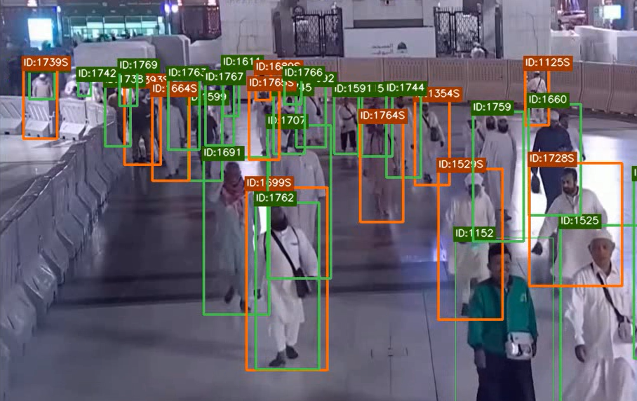
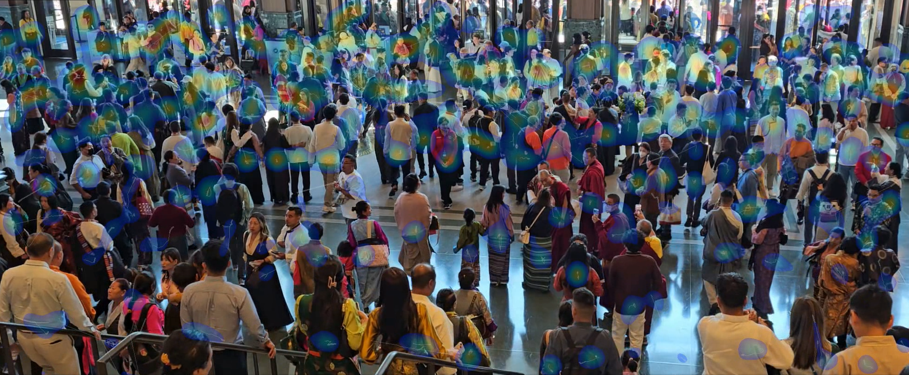
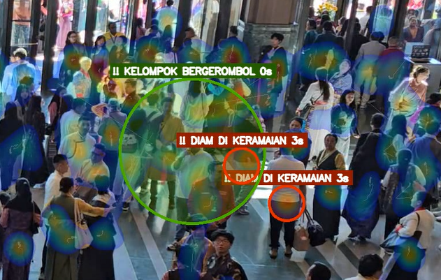
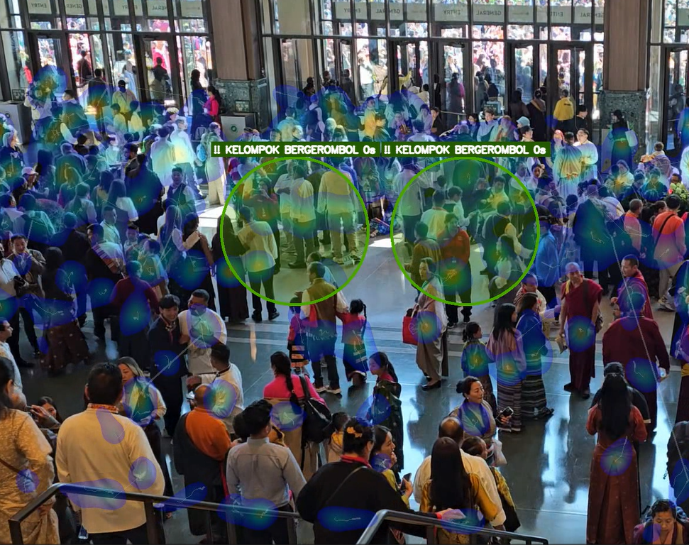
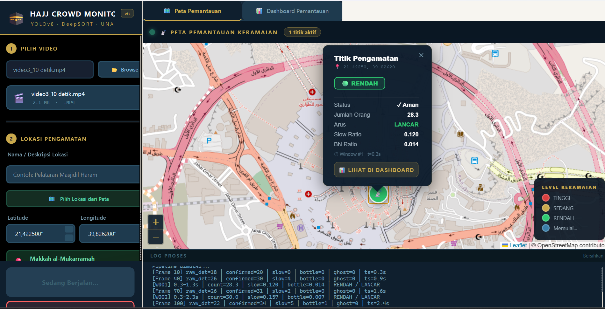
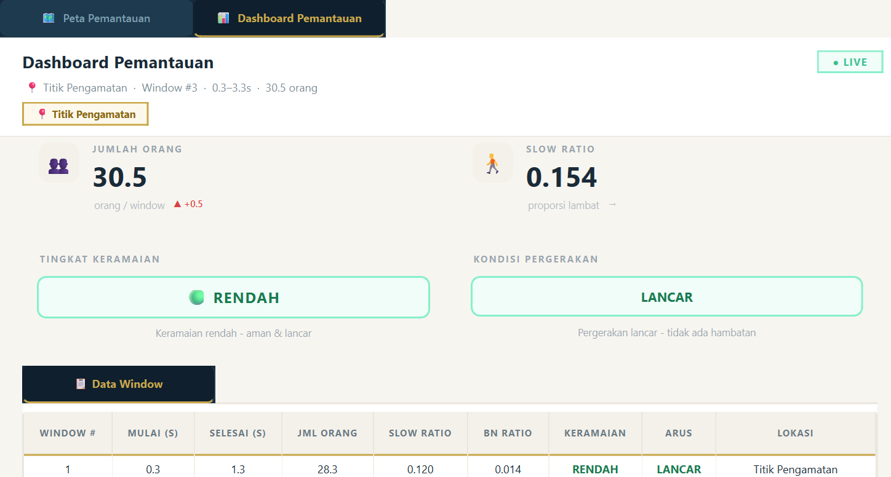

# Hajj Crowd Monitor

Sistem pemantauan keramaian pedestrian jamaah haji berbasis video CCTV menggunakan YOLOv8 dan DeepSORT dilengkapi visualisasi peta interaktif untuk pemantauan real time.

---

## Apa yang Dideteksi dan Divisualisasikan

### Deteksi dan Pelacakan Orang

Setiap orang dalam frame dideteksi menggunakan YOLOv8 dan dilacak dengan DeepSORT, sehingga setiap individu memiliki ID yang antarframe. Dari hasil pelacakan ini dihitung jumlah orang aktif dan kecepatan relatif masing masing.



---

### Heatmap Kepadatan

Heatmap ditampilkan di atas frame video berdasarkan sebaran dan kepadatan orang. Area yang lebih padat ditandai dengan warna merah/kuning, sedangkan area yang lebih kosong berwarna biru.



---

### Klasifikasi Tingkat Keramaian dan Kondisi Pergerakan

Setiap 1 detik, sistem merangkum kondisi keramaian dalam rolling window 10 detik terakhir dan menghasilkan dua label:

**Tingkat keramaian** ditentukan dari rata-rata jumlah orang:

```
C < 60            : RENDAH
60 ≤ C < 90       : SEDANG
C ≥ 90            : TINGGI
```

**Kondisi pergerakan** ditentukan dari proporsi pejalan kaki berkecepatan rendah (slow ratio):

```
Keramaian rendah              : LANCAR (otomatis)
Keramaian sedang/tinggi:
  slow ratio ≥ 0.30           : TERSENDAT
  slow ratio < 0.30           : LANCAR
```

Kecepatan setiap orang dihitung sebagai kecepatan relatif yang dinormalisasi dengan tinggi bounding box, sehingga tidak terpengaruh perbedaan skala akibat perspektif kamera:

```
v_norm = displacement_piksel / (Δt × bbox_height)
```

---

### Alert: Bottleneck

Terdeteksi ketika area tertentu menunjukkan hampir tidak ada pergerakan, orang orang berhenti atau bergerak sangat lambat di bawah ambang bottleneck. Alert ini berbasis grid dan tidak bergantung pada ID individu.


---

### Alert: Diam di Keramaian

Terdeteksi ketika satu atau dua orang berhenti dalam waktu cukup lama sementara orang-orang di sekitarnya terus bergerak. Kondisi ini berpotensi memicu hambatan di tengah arus yang berjalan.



---

### Alert: Kelompok Bergerombol

Terdeteksi ketika beberapa orang berkecepatan rendah atau hampir diam berkumpul di area grid yang sama dalam waktu tertentu. Deteksi ini menggunakan pendekatan berbasis area, bukan berbasis identitas individu (ID).



---

### Peta Interaktif dan Dashboard

Hasil analisis dari setiap titik pengamatan divisualisasikan pada peta interaktif berbasis Leaflet.js. Setiap lokasi ditampilkan sebagai marker berwarna sesuai tingkat keramaiannya - hijau untuk rendah, kuning untuk sedang, merah untuk tinggi yang disertai ringkasan kondisi pada dashboard.



Dashboard analitik di dalam aplikasi menampilkan grafik tren jumlah orang dan slow ratio secara real-time.



---

## Cara Kerja Sistem

```
Video CCTV
    │
    ▼
Deteksi objek per frame (YOLOv8)
    │
    ▼
Pelacakan multi objek antarframe (DeepSORT)
    │
    ▼
Perhitungan v_norm per track
    │
    ▼
Agregasi rolling window 10 detik
    │
    ├──► Klasifikasi keramaian + kondisi pergerakan
    ├──► Deteksi alert (Bottleneck / individu / kelompok diam di keramaian)
    └──► Visualisasi peta + dashboard
```

---

## Persyaratan Sistem

- Python 3.10 atau versi di atasnya
- Windows / macOS / Linux
- RAM minimal 8 GB (disarankan 16 GB)
- GPU opsional (CPU cukup untuk video pendek)

---

## Instalasi

### 1. Clone repositori

```bash
git clone https://github.com/[username]/hajj-crowd-monitor.git
cd hajj-crowd-monitor
```

### 2. Install dependencies

```bash
pip install -r requirements_app.txt
```

### 3. Download file model

Download file `best.pt` dari link berikut dan letakkan di dalam folder `project/`:

🔗 [Link model](https://drive.google.com/drive/folders/1BKVhFzHY4sjDBI1NR560xRMFFZe7sub_?usp=sharing)

Struktur folder setelah download:

```
project/
├── best.pt        ← letakkan di sini
├── main.py
├── run_app.py
└── ...
```

### 4. Siapkan video

Download video contoh dari link berikut dan letakkan di dalam folder `project/videos/`:

🔗 [Link video contoh](https://drive.google.com/drive/folders/1BKVhFzHY4sjDBI1NR560xRMFFZe7sub_?usp=sharing)

---

## Cara Menjalankan

```bash
cd project
python run_app.py
```

Langkah penggunaan:

1. Pilih video - klik Browse dan pilih file video CCTV
2. Isi lokasi - masukkan nama lokasi dan pilih koordinat dari peta
3. Klik Mulai Analisis - sistem akan memproses video
4. Lihat hasil - pantau peta dan dashboard analitik yang diperbarui setiap detik

---

## Struktur Proyek

```
project/
├── app/                        # Komponen antarmuka (PyQt6)
│   ├── main_window.py          # Jendela utama aplikasi
│   ├── worker.py               # Untuk proses analisis
│   ├── styles.py               # Pengaturan design antarmuka
│   └── widgets/
│       ├── chart_widget.py     # Grafik tren jumlah orang dan slow ratio
│       ├── input_panel.py      # Panel input video dan lokasi
│       ├── map_picker.py       # Pemilih koordinat dari peta interaktif
│       ├── results_panel.py    # Panel hasil analisis real time
│       ├── log_panel.py        # Panel log proses
│       └── status_bar.py       # Status bar aplikasi
├── bottleneck_detector.py      # Deteksi area bottleneck berbasis grid
├── classifier.py               # Logika klasifikasi keramaian dan pergerakan
├── detector.py                 # Deteksi objek YOLOv8
├── heatmap.py                  # Heatmap kepadatan
├── main.py                     # Pipeline utama deteksi, tracking, dan output
├── metrics.py                  # Perhitungan v_norm dan slow ratio per track
├── rolling_window.py           # Agregasi temporal rolling window
├── stationary_detector.py      # Deteksi alert kerumunan dan individu diam di keramaian
├── tracker.py                  # Pelacakan  DeepSORT
├── video_writer.py             # Mengatur output video yang sudah beranotasi
├── run_app.py                  # Entry point aplikasi desktop
└── outputs/                    # Hasil analisis (digenerate otomatis)
```

---

## Parameter Utama

| Parameter | Default | Keterangan |
|---|---|---|
| CONF_THRESH | 0.40 | Confidence threshold deteksi YOLOv8 |
| IOU_THRESH | 0.50 | IoU threshold NMS |
| IMGSZ | 1280 | Resolusi piksel |
| TAU | 0.241 | Ambang kecepatan ternormalisasi (Q1 distribusi v_norm kondisi sepi) |
| X_COUNT | 60 | Batas bawah jumlah orang untuk keramaian sedang |
| Y_COUNT | 90 | Batas bawah jumlah orang untuk keramaian tinggi |
| SH | 0.30 | Ambang slow ratio untuk kondisi tersendat |
| WINDOW_S | 10.0 | Durasi rolling window (detik) |

Parameter dapat diubah melalui menu Pengaturan Lanjutan di dalam aplikasi

---

## Output yang Dihasilkan

Setiap kali analisis dijalankan, sistem menyimpan file berikut di folder `outputs/`:

| File | Isi |
|---|---|
| `monitoring_[nama].mp4` | Video beranotasi dengan heatmap dan alert untuk gambaran monitoring |
| `annotated_[nama].mp4` | Video dengan bounding box dan ID tracking per orang |
| `window_[nama].csv` | Data per window (jumlah orang, slow ratio, label) |
| `frame_[nama].csv` | Data per frame (count, n_lambat, sf) |
| `frame_track_[nama].csv` | Data v_norm per track per frame |
| `sd_alerts_[nama].csv` | Riwayat alert yang terdeteksi |
| `meta_[nama].json` | Metadata run (parameter, lokasi, FPS) |

---

## Informasi

Penulis: Kaysa Salsabila Khairunnisa (182221047)  
Program Studi: S1 Fisika, Departemen Fisika  
Fakultas: Sains dan Teknologi, Universitas Airlangga  
Tahun: 2026
